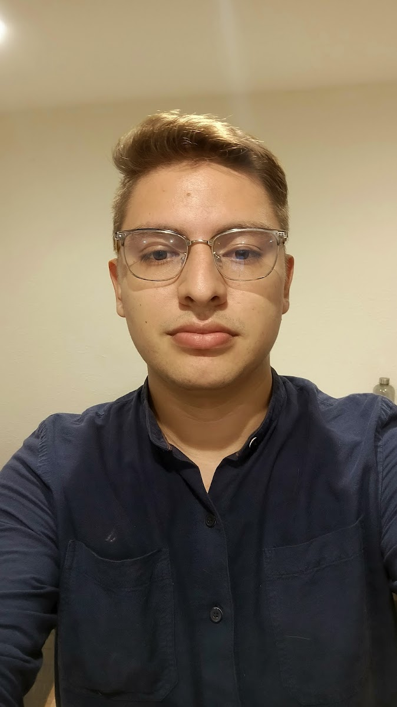

# 📄 CV Luis Ricardo Vanegas Granados

¡Bienvenido/a a mi Curriculum Vitae en formato web! Este proyecto fue desarrollado con **HTML, CSS, JavaScript y TypeScript** con el objetivo de mostrar mi perfil profesional de manera moderna, accesible y responsiva. 🚀

---

## 🧠 Sobre Mí

🎓 **Luis Ricardo Vanegas Granados**  
💼 **Ingeniero de Sistemas** | 🛡️ Especialista en Ciberseguridad | 💻 Desarrollador Fullstack  
📍 Reus, Tarragona, España

Desarrollador comprometido con la eficiencia, la seguridad y la innovación. En constante aprendizaje de tecnologías emergentes. Experiencia sólida en soporte técnico, administración de sistemas, infraestructura TI y desarrollo web.

---

## 🔗 Contacto

- 📧 Email: [luisvanegraes@gmail.com](mailto:luisvanegraes@gmail.com)  
- 📞 Teléfono: (+34) 673 431 587  
- 💼 LinkedIn: [linkedin.com/in/luis-ricardo-vanegas-granados-a4061920a](https://www.linkedin.com/in/luis-ricardo-vanegas-granados-a4061920a)

---

## 🛠️ Tecnologías Utilizadas

| Lenguaje | Descripción |
|----------|-------------|
| `HTML5`  | Maquetación del contenido |
| `CSS3`   | Estilos personalizados responsivos |
| `JavaScript` | Interactividad del sitio |
| `TypeScript` | Lógica adicional con tipado estricto |

---

## 🧩 Estructura del Proyecto

```
📁 CVLUISVANEGAS/
├── css/
│   └── styles.css         # Estilos del CV
├── disc/
│   └── profile.jpg        # Fotografía de perfil
├── js/
│   └── main.js            # Funcionalidades JS
├── ts/
│   └── main.ts            # Lógica TypeScript
├── index.html             # Página principal del CV
├── tsconfig.json          # Configuración de TypeScript
```

---

## 💼 Experiencia Laboral

- **ZAIDAN IT Solutions para LIDL** – Técnico Informático (2025)
- **LACASADELPC** – Técnico Informático (2024)
- **SELECT US** – Ingeniero de Soporte y Proyectos TI (2024)
- **TELEPERFORMANCE COLOMBIA** – Ingeniero de Soporte y Proyectos TI (2024)

---

## 📚 Formación Académica

- 🎓 Máster en Desarrollo Web Fullstack – CIPSA, Barcelona (2025)
- 💻 Bootcamp Fullstack Java – Tech Talent / Mas Carandell (2025)
- 🛡️ Especialización en Ciberseguridad – UAO, Colombia (2025)
- 🖥️ Ingeniería de Sistemas – Universitaria de Colombia (2022)

---

## 🌐 Idiomas

- Español: Nativo 🇪🇸  
- Inglés: A2 🇬🇧  
- Catalán: A2 🇦🇩

---

## 🧠 Habilidades Técnicas

- Administración de Sistemas 🖥️  
- Ciberseguridad 🔒  
- Desarrollo de Software 💻  
- Gestión de Infraestructura TI 🧰  
- Virtualización ☁️  
- ITSM / Service Desk 🛎️  
- Redes y Conectividad 🌐 
- Trabajo en Equipo 🤝

---

## 📷 Vista previa



---

## 🧪 Cómo Ejecutar

1. Clona este repositorio.
2. Abre `index.html` en tu navegador.
3. ¡Listo! 🎉 Puedes editar el contenido desde tu editor de código preferido.

---

## 📌 Nota

Este proyecto se encuentra en constante evolución como parte de mi portafolio profesional. Si tienes alguna sugerencia o deseas colaborar, ¡será más que bienvenida!

---

📌 **Desarrollado por:** *Luis Ricardo Vanegas Granados*
